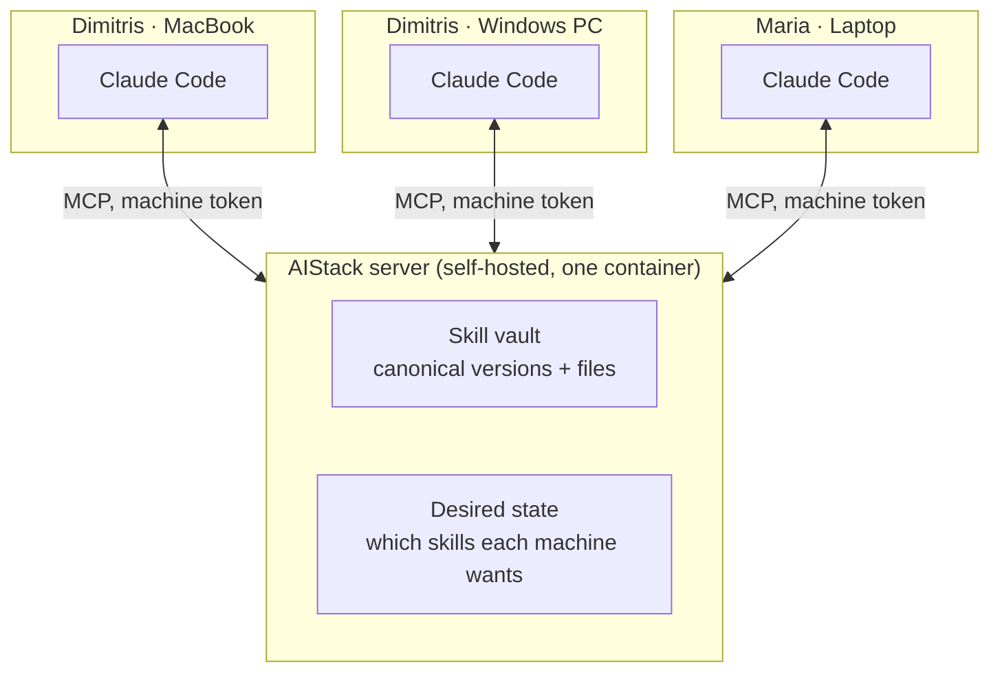

# AIStack

Keep your AI development setup in sync across every developer, machine, and coding agent you use.

Self-hosted. Open source. Driven entirely from chat, through MCP.

> Status: design complete, implementation starting. The architecture, MVP scope, and database schema are settled and documented in [`docs/`](docs/). Code is being written now.

## The problem

Skills, rules, agents, hooks, and MCP servers live in a different place for every tool. Claude Code reads `~/.claude/skills/` and `CLAUDE.md`. Codex wants `AGENTS.md`. Cursor uses `.cursor/rules/`. Each of them keeps its own MCP config.

So a team writing one code-review skill copies it into three tools, on five laptops, and every copy drifts. A developer with a MacBook and a desktop maintains the same setup twice. Nothing is shared, and nobody knows what their teammates are running.

AIStack gives a team one server that holds the canonical copies, and each machine pulls what it needs.

## How it works

You run one container. Everyone connects their coding agent to it as an MCP server, then works in plain language:

```text
"push my wizard skill to aistack"
"what skills does the team have?"
"install python-testing"
"sync aistack"
```

Skills are copied to disk in full and run natively afterwards, with no runtime dependency on AIStack. If the server goes down, every skill on your machine still works. The alternative, small proxy skills that fetch their instructions from the server on trigger, costs more tokens and breaks offline, so it was rejected. [ADR-0001](docs/adr/0001-full-sync-over-runtime-proxy.md) has the numbers.



Each machine authenticates with its own token, so the server knows both who you are and which computer you are on. That is what lets a MacBook and a Windows PC hold different sets of enabled skills.

## MVP

Six MCP tools, one harness (Claude Code), skills only.

| Tool | What it does |
|---|---|
| `join` | Redeem the team invite code, register your first machine, get its token |
| `add_machine` | Register another computer, returns a ready MCP command to paste there |
| `list_skills` | Browse the team vault |
| `get_skill` | Fetch a skill's files for install |
| `push_skill` | Upload a skill, a new push of an existing name creates a new revision |
| `sync` | Compare local state against what the server says this machine should have |

Sync never overwrites a locally modified skill. It asks whether to restore the vault copy, push your edit as a new revision, or leave it alone.

Deliberately not in the MVP: dashboard, CLI, version pinning, project-scoped installs, rules, hooks, agents, MCP gateway. The roadmap in the design document has the order they arrive in.

## Stack

Python 3.13, Poetry, SQLAlchemy, FastMCP. SQLite by default so the whole thing is one container, with Postgres available through `DATABASE_URL` for larger teams ([ADR-0002](docs/adr/0002-sqlite-default-postgres-optional.md)). FastAPI joins later, with the dashboard.

## Documentation

Design decisions are written down before code, and the reasoning is kept.

- [Design document](docs/DESIGN.md), MVP scope, tool contracts, flows, database schema, roadmap
- [Domain glossary](CONTEXT.md), the vocabulary the code and docs both use
- Decision records:
  - [0001 Full local sync instead of runtime proxy skills](docs/adr/0001-full-sync-over-runtime-proxy.md)
  - [0002 SQLite by default, Postgres via DATABASE_URL](docs/adr/0002-sqlite-default-postgres-optional.md)
  - [0003 API tokens with invite-code join, no login system](docs/adr/0003-token-auth-with-invite-code-join.md)
  - [0004 Server-side desired state per machine](docs/adr/0004-server-is-source-of-truth-per-machine.md)

## License

MIT. See [LICENSE](LICENSE).
